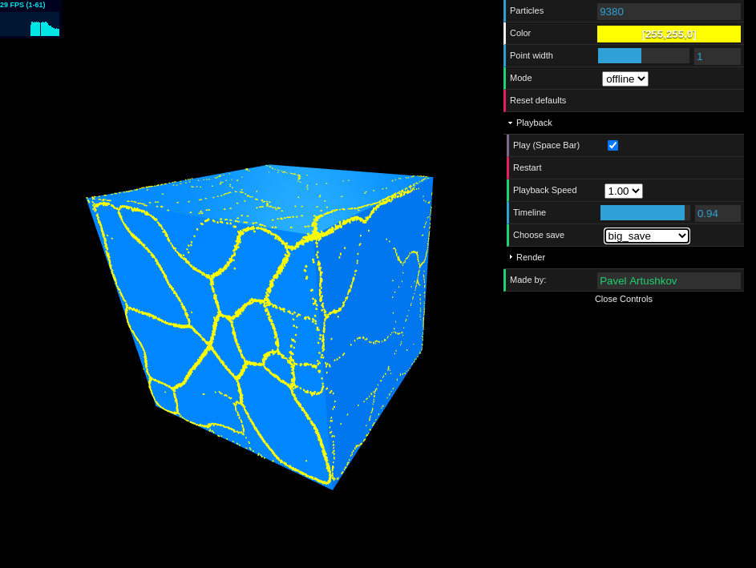
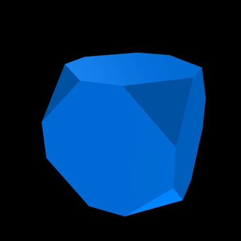
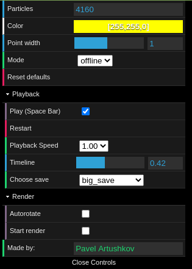

# Physarum\_webGL

[](https://app.codacy.com/gh/physarumAdv/Physarum_webGL?utm_source=github.com&utm_medium=referral&utm_content=physarumAdv/Physarum_webGL&utm_campaign=Badge_Grade_Settings)

This is a visualizer for Physarum Polycephalum's growth written in JavaScript using THREE.js and Node.js libraries.
The visualizer is developed for [this](https://github.com/physarumAdv/minds_crawl) simulator. <br/>
You can also visit this project on a website: [pavTiger.silaeder.ru](http://pavtiger.silaeder.ru)

## Visualizer
There are two visualization modes:
* **Offline**: Show a precalculated growth simulation

* **Online**: If a simulator is working then it will show live growth. <br/>



## Physarum Polycephalum
In nature, this is a mold that minimizes energy on
growth process and food transfer. This way it builds the shortest, and most optimal paths between points.
<br/>  <br/>
It is an experiment made by a group of Japanese scientists. They grew Physarum on the map of Japan
and it successfully reconstructed Japan's road system between cities.

## Polyhedron
Currently, we support all convex polyhedrons, but in future we plan to support any .obj 3D model. <br/>


## Controls
Using controls you can change a variety of parameters like mold's size and color.
Moreover, you can control the speed, timeline and a few more parameters in Offline mode <br/>


## Render mode
As you can notice we have a special tab named "Render".
The main purpose is to render a high quality video (.mp4) of the growth, but it is mostly made for us developers, however other users can still use it.
When you tick this, website starts sending photos of the current canvas to the server, and later they get merged into a video.
This way all renderings are saved on the server and browser doesn't have to merge them.

## Installing
This will install all required libraries
```bash
npm install
```

## Executing
To start Node.js server, hosting visualization on your device run
```bash
./start_endless.sh
```

## Authors
> [Pavel Artushkov](http://t.me/pavtiger), [pavTiger@gmail.com](mailto:pavTiger@gmail.com)
>
> [Nikolay Nechaev](http://t.me/kolayne), [nikolay_nechaev@mail.ru](mailto:nikolay_nechaev@mail.ru)
>
> [Tatiana Kadykova](http://vk.com/ricopin), [tanya-kta@bk.ru](mailto:tanya-kta@bk.ru)
>
> [Olga Starunova](http://vk.com/id2051067), [bogadelenka@mail.ru](mailto:bogadelenka@mail.ru)
