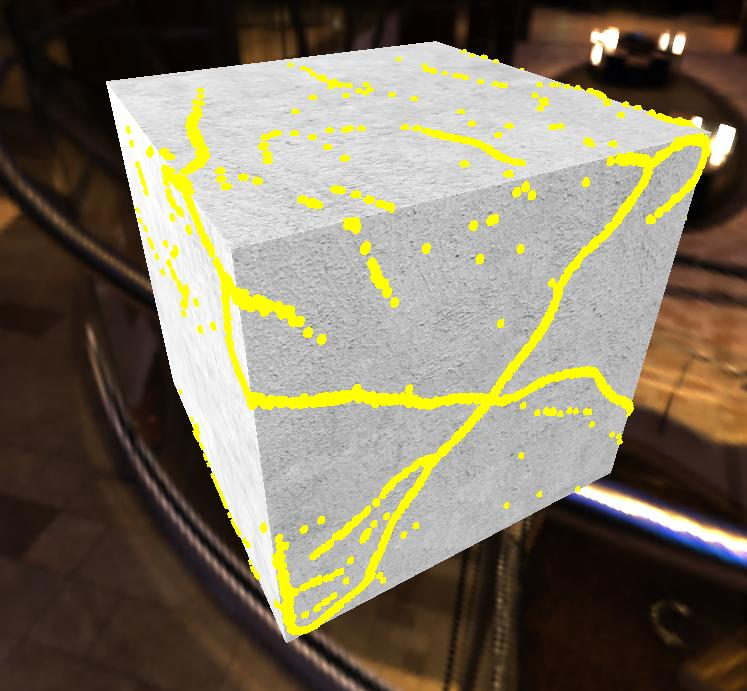
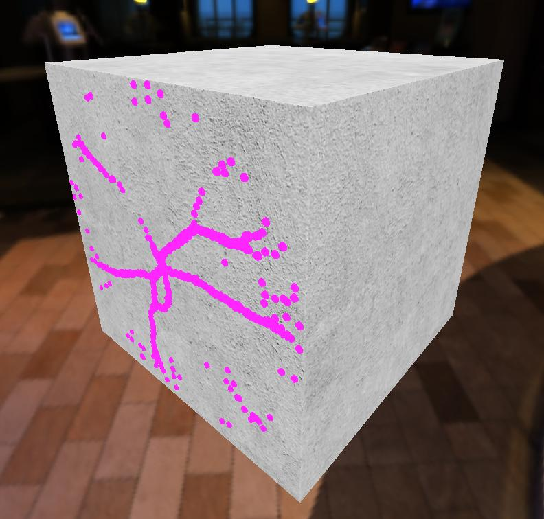

# Physarum\_webGL

Visualization written on JS library THREE.js of a clever mould Physarum Polycephalum

### Physarum Polycephalum 
In nature is a mould that minimizes energy on
growth process and food transfer. This way it builds the shortes and most optimal ways between points

### Cube
Now growth is visualized at a single cube but mesh can be imported as a .gltf 3D format

### Growth

### Change color of the mold
Using a slider at the top-right side of the screen you can change the color of the mold to anything you want while simulation is running

## Authors
> [Pavel Artushkov](http://t.me/pavtiger), <pavTiger@gmail.com>

> [Tatiana Kadykova](http://vk.com/ricopin), <tanya-kta@bk.ru>

> [Nikolay Nechaev](http://t.me/kolayne), <nikolay_nechaev@mail.ru>

> [Olga Starunova](http://vk.com/id2051067), <bogadelenka@mail.ru>

